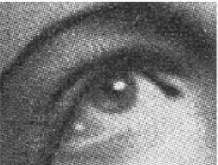

```markdown
# 🖌️ Веб-редактор изображений с фильтрами

Этот проект представляет собой полноценный веб-редактор изображений, работающий прямо в браузере, с поддержкой инструментов рисования, геометрических фигур, заливки и фильтров, реализованных математически (все алгоритмы были реализованы на семинарах и лекциях курса "Компьютерная графика").  
Обработка фильтров написана на Python с использованием Flask, сам редактор — на HTML + CSS + JavaScript.

---

## 🚀 Возможности

### ✏️ Инструменты рисования
- **Кисть (Brush)** — свободное рисование с выбором толщины и формы (круглая / квадратная).
- **Линия (Line)** — отрисовка отрезка по алгоритму Брезенхема.
- **Окружность (Circle)** — отрисовка окружности по модифицированному алгоритму Брезенхема.
- **Заливка (Fill)** — классическая заливка (Flood Fill).
- **Undo** — откат действий.
- **Очистка** — очистка холста.
- **Сохранение изображения** в PNG.
- **Создание нового холста** или загрузка изображения с компьютера.

### 🎨 Фильтры изображения
Все фильтры применяются на стороне Python.  
Поддерживаются фильтры:

| Фильтр | Назначение |
|--------|-------------|
| **Gaussian** | Размытие изображения с использованием гауссова ядра. |
| **Average** | Усредняющий фильтр (блюр без весов). |
| **Black & White** | Перевод в чёрно-белое с яркостным взвешиванием. |
| **Sobel** | Выделение контуров по операторам Собеля. |
| **Prewitt** | Выделение контуров по операторам Превитта. |
| **K-Means** | Кластеризация цветов методом K-средних. |

---
```
## 🧩 Структура проекта

```

project/
├── server.py               # Flask-python программка (обработка фильтров)
├── editor.html             # Основной файл (веб-редактор)
│   
└── README.md               # Этот файл

````

---

## ⚙️ Установка и запуск

### 1. Установите зависимости
```bash
pip install flask flask-cors pillow numpy scipy
````

### 2. Запустите сервер

```bash
python3 server.py
```

По умолчанию сервер запустится на `http://127.0.0.1:5000`

### 3. Откройте `index.html` в браузере

Откройте файл напрямую или через локальный веб-сервер.

---

## 💡 Принцип работы

1. Пользователь загружает изображение или создаёт новое полотно.
2. Все рисовальные операции выполняются **на стороне браузера (Canvas API)**.
3. При применении фильтра:

   * Текущее изображение конвертируется в **Base64**;
   * Отправляется POST-запрос на Flask-сервер;
   * Сервер обрабатывает изображение с помощью **NumPy**;
   * Возвращает обработанный результат обратно в браузер.

---

## 🧠 Алгоритмы инструментов

### ✏️ 1. Алгоритм рисования линии — Брезенхем

Используется целочисленный алгоритм Брезенхема без округления.
Работает за O(max(Δx, Δy)).

(Детально можно почитать тут: https://github.com/NikAvto/line_bresenham)

Формула ошибки:

```
err = dx + dy
```

При каждой итерации:

```
if 2*err >= dy: x += sx; err += dy
if 2*err <= dx: y += sy; err += dx
```

Линия получается ровной и без антиалиасинга.

---

### ⚪ 2. Алгоритм окружности — модифицированный Брезенхем

Окружность рисуется по симметрии, вычисляя точки `(x, y)` вокруг центра `(cx, cy)` (Детально можно почитать тут: https://github.com/NikAvto/circle_bresenham):

```
x² + y² = r²
```

Толщина задаётся двойным циклом в пределах lineWidth.

---

### 🌊 3. Алгоритм заливки — Flood Fill

Используется итеративная реализация со стеком (без рекурсии):

```js
stack.push({x, y})
while stack not empty:
  pixel = stack.pop()
  if цвет совпадает с исходным:
     закрасить пиксель
     добавить соседей (вверх, вниз, влево, вправо)
```

Сравнение цветов выполняется строго по RGBA.

---

## 🧮 Алгоритмы фильтров (обработка на Python)

### 🌀 1. Гауссов фильтр

Используется двумерное ядро:

```
G(x,y) = exp(-(x² + y²) / (2σ²))
```

Все значения нормируются, чтобы сумма ядра = 1.
Затем выполняется двумерная свёртка (convolution).

---

### 🔲 2. Усредняющий фильтр

Простое усреднение по окрестности `N×N`:

```
kernel = np.ones((N, N)) / (N*N)
```

Каждый пиксель заменяется на среднее соседних.

---

### ⚫ 3. Чёрно-белый фильтр

Используется яркостная формула NTSC:

```
Y = 0.299R + 0.587G + 0.114B
```

Все каналы получают значение `Y`.

---

### 🧭 4. Фильтр Собеля

Два ядра для X и Y направлений:

```
Gx = [[-1 0 1], [-2 0 2], [-1 0 1]]
Gy = [[ 1 2 1], [ 0 0 0], [-1 -2 -1]]
```

Модуль градиента:

```
M = sqrt(Gx² + Gy²)
```

Результат нормируется в диапазон [0, 1].

---

### 🧭 5. Фильтр Превитта

Похожие ядра, но с равномерными весами:

```
Gx = [[-1 0 1], [-1 0 1], [-1 0 1]]
Gy = [[ 1 1 1], [ 0 0 0], [-1 -1 -1]]
```

Реагирует сильнее на резкие перепады яркости, но менее чувствителен к шуму.

---

### 🎨 6. Фильтр K-средних (кластеризация цветов)

1. Все пиксели преобразуются в векторы RGB.
2. Выбираются K случайных центроидов.
3. Для каждого пикселя ищется ближайший центроид (по Евклидову расстоянию).
4. Центроиды пересчитываются как среднее своих кластеров.
5. Процесс повторяется до сходимости (или 10 итераций).

Математическая формула:

```
C_i = (1 / |S_i|) * Σ x_j,  где x_j ∈ S_i
```

Где `C_i` — центр кластера, `S_i` — множество пикселей в нём.

---

Сервер выполняет кластеризацию с указанным числом цветов.

---

## 🧰 Вспомогательные функции

### `apply_filter(image, kernel)`

Применяет 2D-свёртку ко всем трём каналам RGB отдельно с нулевым заполнением краёв.

### `hexToRgb(hex)`

Преобразует HEX-код цвета в объект `{r, g, b}`.

### `saveState() / undo()`

Хранит историю состояний холста в массиве `undoStack` для возможности отката на действие назад.

---

## 🖼️ Пример работы

| До                                         | После (Собель)                            |
| ------------------------------------------ | ----------------------------------------- |
|                       |  |
